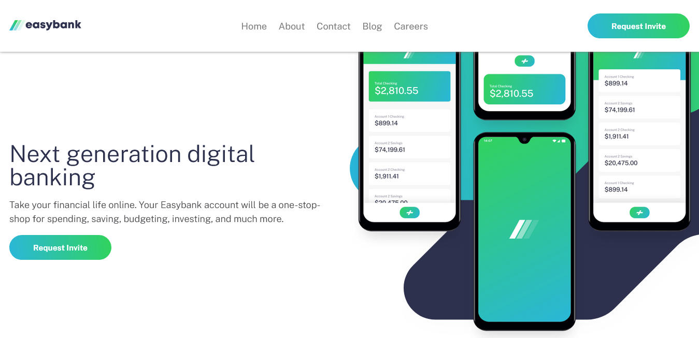

# Easybank landing page solution

This is a solution to the
[Easybank landing page challenge on Frontend Mentor](https://www.frontendmentor.io/challenges/easybank-landing-page-WaUhkoDN).
Frontend Mentor challenges help you improve your coding skills by building
realistic projects.

## Table of contents

- [Overview](#overview)
  - [Screenshot](#screenshot)
  - [Links](#links)
- [My process](#my-process)
  - [Built with](#built-with)
  - [What I learned](#what-i-learned)
  - [Continued development](#continued-development)
- [Author](#author)

## Overview

A landing page with a toggle menu on mobile and gradient buttons which shift on
hover.

### Screenshot

### Links

- Solution URL: [Add solution URL here](https://your-solution-url.com)
- Live Site URL:
  [https://easybank-kc.vercel.app/](https://easybank-kc.vercel.app/)

## My process

Working with a mobile-first approach, I followed some advice I got from a Kevin
Powell video, I sectioned each item of the page into blocks first, then I wrote
out the base blocks in HTML. After all that, I began to look at the blocks in
the blocks. I tried to make choices on tags that indicated what they were
holding. I used `divs` as wrappers a bit, and `sections` and `articles` tags
often!

### Built with

- Semantic HTML5 markup
- CSS custom properties
- Flexbox
- CSS Grid
- Mobile-first workflow

### What I learned

I learned how to use the `resize` eventListener in JavaScript to make sure that
if the screenwidth is changed that the mobile-menu will disappear. It is
something I had struggled with early on and I didn't realise it had a fix in
this way, and I feel really happy with this little nugget of code.

I also got to play a bit more with animation key-frames, for the menu-slide in
animation on mobile. I personally struggle to find a balance on them, but, I
like how this one turned out.

### Continued development

- CSS neatness/organization
- BEM (I need to practice more, I tried to use it here, but more work is needed)
- Refactoring the HTML / care was taken to use semnatic tags, but, more work is
  needed to refine it

## Author

- Frontend Mentor -
  [@ofthewildfire](https://www.frontendmentor.io/profile/ofthewildfire)
- Twitter - [@im_kfox](https://www.twitter.com/im_kfox)
